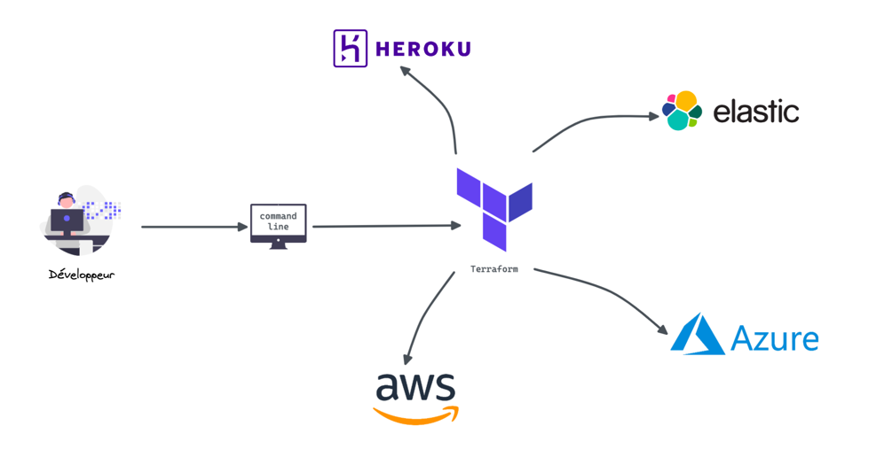
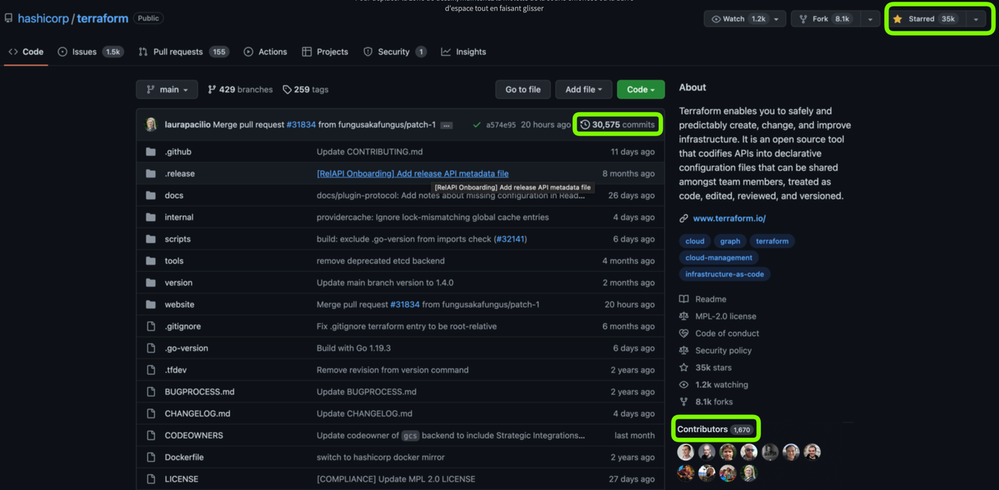
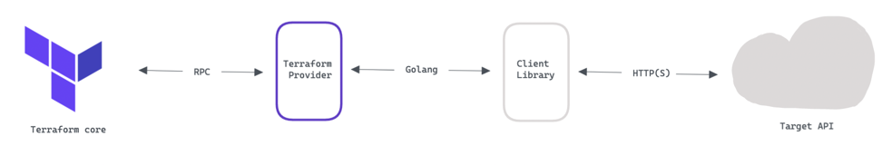
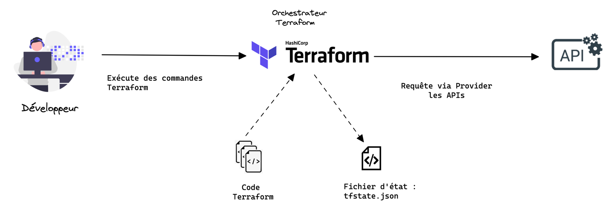
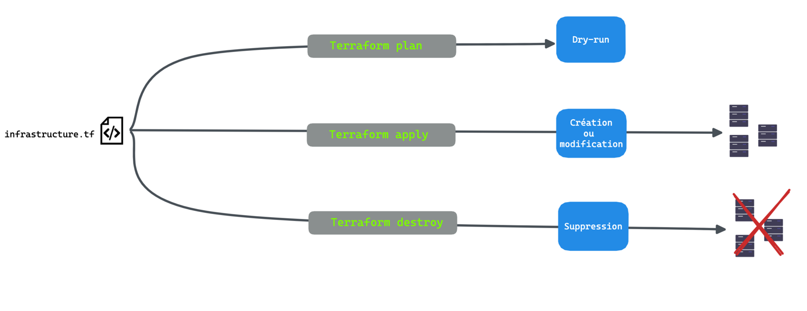
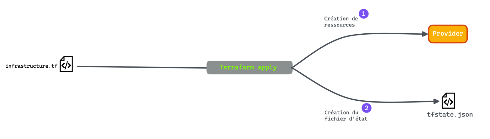
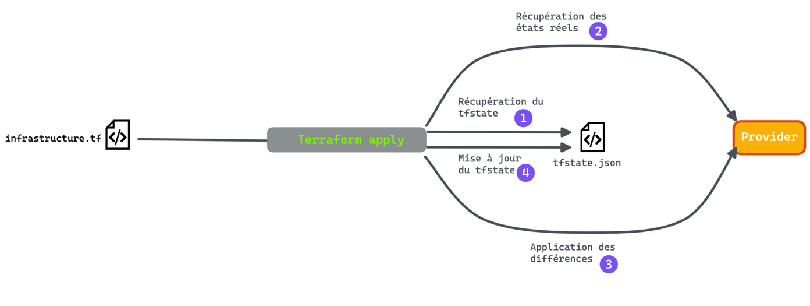

## Objectifs :

+ Comprendre les concepts : `terraform core` & `terraform plugin`
+ Connaitre les différents workflows de terraform

------------

<!--truncate-->

## Rappels : 101 Terraform

Terraform est un **projet open source** créé en **2014** par [Hashicorp](https://www.hashicorp.com/).

A l'écriture de ce blog, terraform a :
+ `35K` ⭐️
+ Plus de `30k commits`
+ Plus de `1600 contributeurs`

_https://github.com/hashicorp/terraform_

**Ce qu'on peut faire avec Terraform :**
+ Gérer des ressources d'infrastructure de plusieurs **fournisseurs cloud**
  + Créer une infrastructure réseau sur AWS
  + Déployer un cluster Kubernetes sur GCP
+ Intéragir avec des **produits d'infrastructure**
  + Insérer des secrets dans un Vault 
  + Déployer une application sur Heroku
+ Configurer des **services d’infrastructure**
  + Créer un projet/groupe/utilisateur sur GitLab
  + Initialiser une base de données PostgreSQL (et ses utilisateurs)

------------

## Les concepts : Terraform Core & Terraform Plugin

Terraform a la capacité de se **brancher** avec de **nombreux providers** : _AWS, GCP, AZURE, ELASTIC..._ _Mais le fonctionnement interne de terraform ne change pas entre 2 providers._

Pour cela, Terraform est composé de **2 parties** _(séparées par un contrat d'interfaçage)_ :
+ **Terraform Core :** Il s'agit du binaire Terraform qui communique avec les plugins pour gérer les ressources de l'infrastructure.
Il fournit une interface commune qui vous permet de tirer parti de nombreux fournisseurs
de Clouds, bases de données, services et solutions internes.

+ **Terraform Plugin :** Il s'agit de binaires exécutables écrits en Go qui communiquent avec Terraform Core via une interface RPC. Chaque plugin expose une implémentation pour un service spécifique, tel que le fournisseur AWS ou le 
fournisseur cloud-init. 

Actuellement terraform supporte qu'un type de plugin appelé [Providers](https://developer.hashicorp.com/terraform/language/providers), veuillez retrouver la liste sur ce lien : https://registry.terraform.io/browse/providers

:::tip Des custom plugin
On peut également développer nos propres providers, terraform propose un tutoriel : [Implement a Provider with the Terraform Plugin Framework](https://developer.hashicorp.com/terraform/tutorials/providers-plugin-framework/providers-plugin-framework-provider)
:::

## Cinématique générale de Terraform

1. Le développeur(se) 🧑🏻‍💻 **développe** le code terraform
1. Le développeur(se) 🧑🏻‍💻 **exécute** des commandes terraform
1. Terraform lit la **configuration** (code) ainsi que le **fichier d'état** _(s'il y en a déjà un)_
1. Terraform crée un **plan d'exécution** : arbre de dépendances 
1. Terraform communique avec les APIs du provider pour **appliquer les changements**

## Les workflows terraform

Dans cette section nous allons voir les différents workflow Terraform : 
+ `Workflow standard`
+ `Workflow lors d'une création d'infrastructure`
+ `Workflow lors d'une mise à jour d'infrastructure`

### Workflow standard
----------------------

>Pour mettre en place notre **working directory** il faut lancer la commande suivante :
   + `terraform init` 
>
> ⚠️ A chaque ajout de nouveau [module](https://developer.hashicorp.com/terraform/language/modules/syntax) ou de provider il faudra, re-lancer cette commande.

Une fois l'initialisation faite, le worklow standard pour développer du terraform peut se résumer en **3 étapes** :

1. `terraform plan` : **affiche** les changements requis par la configuration actuelle _(plan d'exécution)_
1. `terraform apply` : permet d'**appliquer** le plan d'exécution sur l'infrastructure réelle.
1. `terraform destroy` : permet de **supprimer** toute l'infrastructure crée avec Terraform 

> 💡 Une fois qu'on a développé notre code terraform, on peut le **vérifier** avec la commande : 
`terraform validate`

Pour aller plus loin : [The Core Terraform Workflow](https://developer.hashicorp.com/terraform/intro/core-workflow)

### Workflow lors d'une création d'infrastructure
--------------------------------------------------

Pour la première exécution de la commande `terraform apply` : 
+ Terraform crée **l'infrastructure** définie dans votre configuration (code terraform).
+ Terraform crée le **fichier d'état** : `tfstate`.  

Le fichier d'état est utilisé par Terraform pour faire **correspondre** les **ressources du monde réel** à votre **configuration** et conserver la trace des métadonnées.

### Workflow lors d'une mise à jour d'infrastructure
----------------------------------------------------

1. `Récupération du tfstate` :  récupérer le dernier état mis à jour par terraform.
2. `Récupération des états réels` : récupérer les éventuels changements d'infrastructure, externe à terraform (modification à la main).
3. `Application des différences` : créer un plan d'exécution et appliquer ces changements sur l'infrastructure réelle.
4. `Mise à jour du tfstate` :  mettre à jour le tfstate avec l'infrastructure actuelle.

## Conclusion

Terraform a plusieurs **couches d'abstraction** et dans ce blog nous avons couvert : 
+ L'intéraction entre Terraform et les APIs des fournisseurs : `Terraform Core` **&** `Terraform Plugin`
+ Les différents workflows derrière la commande `terraform apply`.