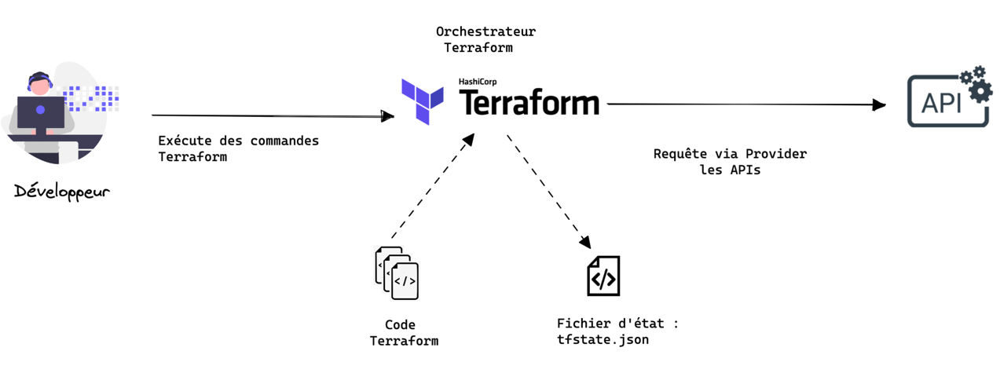

## Objectifs :

+ Comprendre les concepts : `terraform core` & `terraform plugin`
+ Connaitre les différents workflows de terraform

------------

<!--truncate-->

## Rappels : 101 Terraform

Terraform est un **projet open source** crée en **2014** par [Hashicorp](https://www.hashicorp.com/).

A l'écriture de ce blog, terraform a :
+ `35K` ⭐️
+ Plus de `30k commits`
+ Plus de `1600 contributeurs`

_https://github.com/hashicorp/terraform_

**Ce qu'on peut faire avec Terraform :**
+ Gérer des ressources d'infrastructure sur des **fournisseurs de cloud**
  + Créer une infrastructure réseau sur AWS
  + Déployer un Kubernetes sur GCP
+ Intéragir avec des **produits d'infrastructure**
  + Insérer des secrets dans un Vault 
  + Déployer une application sur Heroku
+ Configurer des **services d’infrastructure**
  + Créer un projet/groupe/utilisateur sur GitLab
  + Initialiser une base de données PostgreSQL (et ses utilisateurs)

------------

## Les concepts : Terraform Core & Terraform Plugin

**Terraform est composé de 2 parties :** 
+ **Terraform Core :** Il s'agit du binaire Terraform qui communique avec les plugins pour gérer les ressources de l'infrastructure.
Il fournit une interface commune qui vous permet de tirer parti de nombreux fournisseurs
de Clouds, bases de données, services et solutions internes.

+ **Terraform Plugin :** Il s'agit de binaires exécutables écrits en Go qui communiquent avec Terraform Core via une interface RPC. Chaque plugin expose une implémentation pour un service spécifique, tel que le fournisseur AWS ou le 
fournisseur cloud-init. 

Actuellement terraform supporte qu'un type de plugin appelé [Providers](https://developer.hashicorp.com/terraform/language/providers), veuillez retrouver la liste sur ce lien : https://registry.terraform.io/browse/providers

:::tip Des custom plugin
On peut également développer nos propres providers, terraform propose un tutoriel : [Implement a Provider with the Terraform Plugin Framework](https://developer.hashicorp.com/terraform/tutorials/providers-plugin-framework/providers-plugin-framework-provider)
:::

## Cinématique générale de Terraform

1. Le développeur(se) 🧑🏻‍💻 **développe** le code terraform
1. Le développeur(se) 🧑🏻‍💻 **exécute** des commandes terraform
1. Terraform lit la **configuration** (code) ainsi que le **fichier d'état** _(s'il y en a déjà un)_
1. Terraform crée un **plan d'exécution** : arbre de dépendances 
1. Terraform communique avec les APIs du provider pour **appliquer les changements**

## Les workflows terraform

### Workflow standard
----------------------

1. Pour mettre en place notre **working directory** il faut lancer la commande suivante :
   + `terraform init` 

⚠️ A chaque ajout de nouveau [module](https://developer.hashicorp.com/terraform/language/modules/syntax) ou de provider il faudra lancer cette commande

2. Une fois qu'on a développer notre code terraform, on peut le **vérifier** avec la commande : 
   + `terraform validate`

3. Pour connaitre le plan d'exécution, cad afficher les changements requis par la configuration actuelle :
   + `terraform plan`
4. Appliquer le plan d'exécution sur l'infrastructure réelle avec : 
   + `terraform apply`

:::danger Suppression de l'infrastructure
Si on veut supprimer toute l'infrastructure crée avec terraform, il faut lancer : `terraform destroy` 
:::

### Workflow lors d'une création d'infrastructure
--------------------------------------------------

Pour la première exécution de la commande `terraform apply`, terraform crée : 
+ l'infrastructure définie dans votre configuration (code terraform)
+ Le fichier d'état : `tfstate`  

Ce fichier d'état est utilisé par Terraform pour faire **correspondre** les **ressources du monde réel** à votre **configuration** et conserver la trace des métadonnées.

### Workflow lors d'une mise à jour d'infrastructure
----------------------------------------------------

1. `Récupération du tfstate` : dernier état mis à jour par terraform
2. `Récupération des états réels` : récupérer les éventuels changements d'infrastructure, externe à terraform (modification à la main)
3. `Application des différences` : Création du plan d'exécution et application des changements sur l'infrastructure 
4. `Mise à jour du tfstate`

