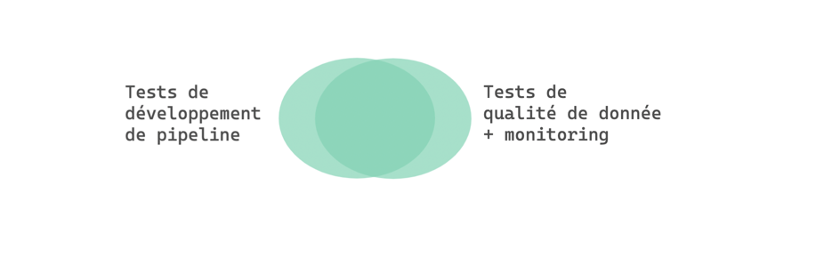

## Objectifs :

+ Dans quel context et Pourquoi faut-il les mettre en place ?
  + Si vous apportez une modification d'infrastructure ou de code à un pipeline, comment savez-vous que vous n'avez rien cassé ?
  + Les tests de non-régression manuels sont long et certaines fois des erreurs nous échappent (l'erreur humaine)
  + 
+ Comment les mettre en place (théorie)?
  + Env isolé ?
  + des données de test fixées et connues en input
  + des données d'assertions verifiées à la main
  + Rapprochement du métier/PO --> BDD
--> Comment les mettre en place (pratique) ? (futur article)

------------

<!--truncate-->

Les tests des pipelines de données sont différents des tests d'autres applications, comme le backend d'un site web.

Il y a une dualité de tests dans un contexte data; les tests sur la `donnée` ⚡️ sur le `code` :
+ Les tests de qualité de données ont pour rôle de : 
  + Détecter des anomalies 
  + Signaler des valeurs de données aberrantes.
+ Les tests sur le code assurent la qualité logicielle minimale, ces différents types de tests sont représentés ci-desous

## Table des matières

* [Rappels : ](#rappels-)
* [Dans quel context ?](#dans-quel-context-)
* [Pourquoi faut-il les mettre en place ?](#pourquoi-faut-il-les-mettre-en-place-)
* [Par ou commencer ?](#par-ou-commencer-)
* [Covention Dalkia](#convention-dalkia)

------------------------------------------------------------------------------------------------------------------------

## Rappels : 

### C'est quoi une pipeline de donnée ?

> 💡 Dans le livre [Fundamentals of Data Engineering](https://www.oreilly.com/library/view/fundamentals-of-data/9781098108298/) 
> il associe la pipeline de donnée au Data Engineering lifecycle, c'est l'endroit ou le Data Engineer intervient le plus
> souvent.

_Les données entrent en continues d'un côté du pipeline, progressent à travers une série d'étapes et sortent sous la forme 
de rapports, de modèles et de vues._   

_Il est utile de conceptualiser le pipeline de données comme une chaîne de fabrication où la qualité, l'efficacité, 
les contraintes et le temps de fonctionnement doivent être gérés._

> Le pipeline de données est le côté **"opérationnel"** de l'analyse des données.

### Les étapes d'une pipeline de donnée :

1. **Génération / Système source :** c'est l'origine des données utilisées.  
   _Par exemple_, un système source peut être : 
   * Un objet IOT
   * Une application qui gère une file d'attente de messages
   * Une base de donnée transactionnelle  
   
   Souvent en tant que Data Engineer, nous consommons des données d'un système source mais nous n'en n'avons pas le contrôle.

2. **Stockage :** Vous avez besoin d'un endroit pour stocker :
   *  Les données du système source 
   *  Les résultats des transformations
   *  Les données exposées 
   
   Quel type de solution de stockage devez-vous utiliser ? Cela dépend de vos cas d'utilisation, des volumes de données,
   de la fréquence d'ingestion, du format et de la taille des données ingérées.

3. **Ingestion :** Après avoir compris la source de données, les caractéristiques du système source que vous utilisez et 
   la manière dont les données sont stockées, `vous devez rassembler les données`. L'étape suivante du cycle de vie 
   du Data Engineering est l'ingestion des données à partir des systèmes sources.   
   > 💡 Pour cette étape il y 2 grands concepts à connaitre que nous n'addresserons pas dans cet article: 
   * `Batch` VS `Streaming` 
   * `Push` VS `Pull` 
   
4. **Transformation :** Signifie que les données doivent être changées de leur forme originale en quelque chose d'`utile` pour
   les cas d'utilisation en aval.  
   Sans transformations appropriées, les données resteront inertes, et ne seront pas sous une forme utile pour les 
   rapports, l'analyse ou le ML. Typiquement, l'étape de transformation est celle où les données commencent à créer 
   de la `valeur` pour la consommation des utilisateurs en aval.

5. **Données de consommation :** Maintenant que les données ont été ingérées, stockées et transformées en structures 
   cohérentes et utiles, il est temps de les `valoriser`.  
   Les valoriser à travers le utilisations les plus courantes comme :
   * L'`analytique` 
   * Le `ML` 
   * Le `reverse ETL`

Dans l'analyse de données, il y a deux façons courantes d'être embarrassé professionnellement :
*  Laisser des `données de mauvaise qualité` atteindre les utilisateurs.
*  Déployer des `changements qui cassent les systèmes de production`

Et pour éviter ces problèmes nous allons introduire deux workflows clés.

### Deux Workflows clés : Le Pipeline de Valeur & Le Pipeline d'Innovation

> Ces 2 workflows clés sont définis dans le livre DataOps : https://dkproduction.wpenginepowered.com/wp-content/uploads/2020/11/DK_dataops_book_2nd_edition.pdf

La différence entre les deux workflows :

_la pipeline de valeur se situe sur l'environnement de `production` tandis que la
pipeline d'innovation est sur une `sandboxe` (Dev)._

Pour le `pipeline de valeur`, lorsque les données en sortent sous la sous forme d'analyses utiles, de la `valeur est créée pour l'organisation`.

Pour le `pipeline d'innovation`, il cherche à améliorer l'analyse des données en mettant en œuvre de nouvelles idées qui produisent des _"insigths"_ analytiques.

**Pourquoi introduire ces 2 concepts ?** 

Car on pourrait résumer la qualité de nos résultats à : 

`qualité de notre service = f(data, code)`

Le pipeline de valeur ( pipeline en production ) traite les données de production qui sont mises à jours à differentes fréquences, mais le code reste constant ( fixé / releasé ).   
➡️ Code constant mais donnée variable 

> ⚠️ Le pire scénario dans ce pipeline de valeur est de recevoir des données de mauvaise qualité. 

Le pipeline d'innovation, la donnée est controlée / stable pour éviter les effets de bords pendant les développements.
Par contre le code sera modifié régulièrement durant cette phase pour arriver à la qualité et au fonctionnement 
souhaité.  
➡️ Code variable mais donnée constante (fixée). 

> ⚠️ Le pire scénario dans ce pipeline d'innovation est d'introduire des régressions dans les changements du système 
> (code). 

Il y aura une dualité sur les tests : 
+ En production, on retrouvera les tests de données et monitoring
+ En développement, on retrouvera les tests unitaires, fonctionnels, performances ...

Pour le pipeline d'innovation il est important de mettre en place une stratégie de tests, afin de valider le système et
de nous assurer de ne pas faire de régressions dans de futurs changements.

Les tests que nous pouvons mettre en place : 
 
 

https://jaayap.github.io/Unity_Best_Practices/Fr/Unit_Test_And_TDD.html

Pour le pipeline de valeur, il faut contrôler la donnée en entrée, en sortie et à la fin de chaque étapes de traitements.

