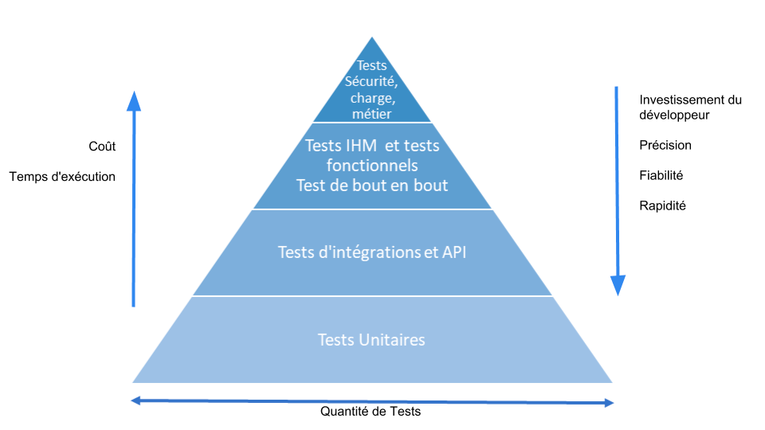
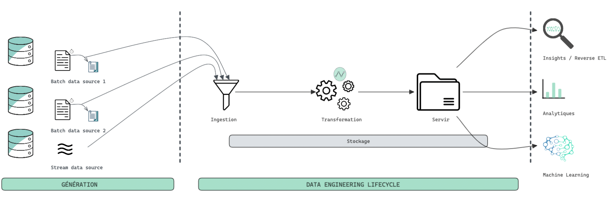
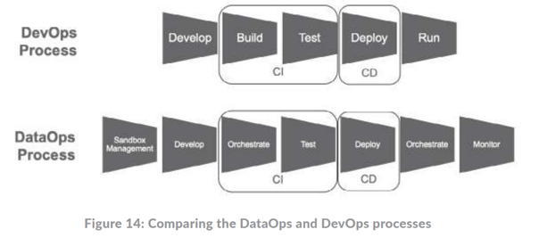
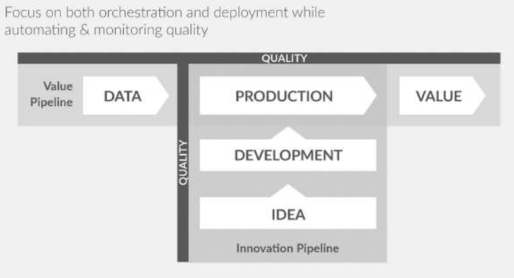
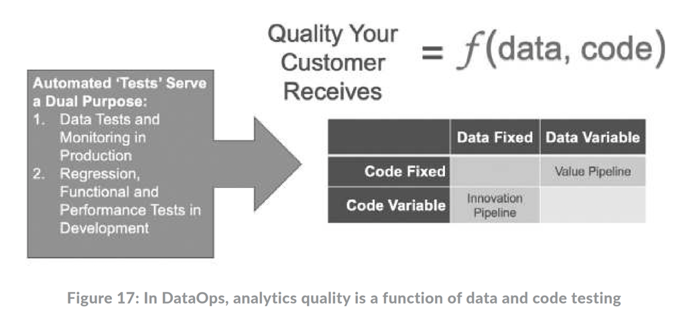

## Objectifs :

+ Dans quel context et Pourquoi faut-il les mettre en place ?
  + Si vous apportez une modification d'infrastructure ou de code à un pipeline, comment savez-vous que vous n'avez rien cassé ?
  + Les tests de non-régression manuels sont long et certaines fois des erreurs nous échappent (l'erreur humaine)
  + 
+ Comment les mettre en place (théorie)?
  + Env isolé ?
  + des données de test fixées et connues en input
  + des données d'assertions verifiées à la main
  + Rapprochement du métier/PO --> BDD
--> Comment les mettre en place (pratique) ? (futur article)

------------

<!--truncate-->

Les tests des pipelines de données sont différents des tests d'autres applications, comme le backend d'un site web.

Il y a une dualité de tests dans un contexte data, les tests sur la donnée et sur le code :
+ Les tests de qualité de données ont pour rôle de : 
  + Détecter des anomalies 
  + Signaler des valeurs de données aberrantes.
+ Les tests sur le code assurent la qualité logicielle minimale, ces différents types de tests sont représentés ci-desous
 

https://jaayap.github.io/Unity_Best_Practices/Fr/Unit_Test_And_TDD.html

## Table des matières

* [Rappels : ](#rappels-)
* [Dans quel context ?](#dans-quel-context-)
* [Pourquoi faut-il les mettre en place ?](#pourquoi-faut-il-les-mettre-en-place-)
* [Par ou commencer ?](#par-ou-commencer-)
* [Covention Dalkia](#convention-dalkia)

------------------------------------------------------------------------------------------------------------------------

## Rappels : 

### C'est quoi une pipeline de donnée ?

> 💡 Dans le livre [Fundamentals of Data Engineering](https://www.oreilly.com/library/view/fundamentals-of-data/9781098108298/) 
> il associe la pipeline de donnée au Data Engineering lifecycle, c'est l'endroit ou le Data Engineer intervient le plus
> souvent.

_Les données entrent en continues d'un côté du pipeline, progressent à travers une série d'étapes et sortent sous la forme 
de rapports, de modèles et de vues._   

_Il est utile de conceptualiser le pipeline de données comme une chaîne de fabrication où la qualité, l'efficacité, 
les contraintes et le temps de fonctionnement doivent être gérés._

> Le pipeline de données est le côté **"opérationnel"** de l'analyse des données.

### Les étapes d'une pipeline de donnée :

1. **Génération / Système source :** c'est l'origine des données utilisées.  
   _Par exemple_, un système source peut être : 
   * Un objet IOT
   * Une application qui gère une file d'attente de messages
   * Une base de donnée transactionnelle  
   
   Souvent en tant que Data Engineer, nous consommons des données d'un système source mais nous n'en n'avons pas le contrôle.

2. **Stockage :** Vous avez besoin d'un endroit pour stocker :
   *  Les données du système source 
   *  Les résultats des transformations
   *  Les données exposées 
   
   Quel type de solution de stockage devez-vous utiliser ? Cela dépend de vos cas d'utilisation, des volumes de données,
   de la fréquence d'ingestion, du format et de la taille des données ingérées.

3. **Ingestion :** Après avoir compris la source de données, les caractéristiques du système source que vous utilisez et 
   la manière dont les données sont stockées, `vous devez rassembler les données`. L'étape suivante du cycle de vie 
   du Data Engineering est l'ingestion des données à partir des systèmes sources.   
   > 💡 Pour cette étape il y 2 grands concepts à connaitre que nous n'addresserons pas dans cet article: 
   * `Batch` VS `Streaming` 
   * `Push` VS `Pull` 
   
4. **Transformation :** Signifie que les données doivent être changées de leur forme originale en quelque chose d'`utile` pour
   les cas d'utilisation en aval.  
   Sans transformations appropriées, les données resteront inertes, et ne seront pas sous une forme utile pour les 
   rapports, l'analyse ou le ML. Typiquement, l'étape de transformation est celle où les données commencent à créer 
   de la `valeur` pour la consommation des utilisateurs en aval.

5. **Données de consommation :** Maintenant que les données ont été ingérées, stockées et transformées en structures 
   cohérentes et utiles, il est temps de les `valoriser`.  
   Les valoriser à travers le utilisations les plus courantes comme :
   * L'`analytique` 
   * Le `ML` 
   * Le `reverse ETL`

Dans l'analyse de données, il y a deux façons courantes d'être embarrassé professionnellement :
*  Laisser des `données de mauvaise qualité` atteindre les utilisateurs.
*  Déployer des `changements qui cassent les systèmes de production`

Et pour éviter ces problèmes nous allons introduire deux workflows clés.

### Deux Workflows clés : Le Pipeline de Valeur & Le Pipeline d'Innovation
> Ces 2 workflows clés sont définis dans le livre DataOps : https://dkproduction.wpenginepowered.com/wp-content/uploads/2020/11/DK_dataops_book_2nd_edition.pdf

L'analyse des données vise à extraire de la valeur des données. C'est ce que nous appelons le pipeline de valeur. 
Le diagramme ci-dessous montre le pipeline de valeur progressant horizontalement de gauche à droite. 
Les données entrent dans le pipeline et passent en traitement de production. La production représente la pipeline de donnée. 

Lorsque les données sortent du pipeline, sous la sous forme d'analyses utiles, de la `valeur est créée pour l'organisation`.

Avant d'expliquer ces 2 workflows, regardons la différence entre une pipeline `CI/CD` dans un contexte `DevOps` ⚡️ `DataOps` :

Il est important de noter que l'orchestration** apparaît deux fois dans le processus DataOps illustré dans la figure ci-dessus.

La première orchestration représente la **pipeline d'innovation**.
Cetter dernière cherche à améliorer l'analyse des données en mettant en œuvre de nouvelles idées qui produisent des 
_"insigths"_ analytiques. 

> _Exemple :_  
> _Actuellement nous mettons à disposition les données aggrégées à la journée, et on aimerait également mettre à 
disposition les données aggrégées par mois et par pays._

Pendant le développement de cette pipeline, les données restent statiques mais le code changent afin de pouvoir tester 
l'algorithm sans avoir d'effets de bords provenant de la donnée.

Sur le schéma ci-dessus, la deuxième orchestration représente la **pipeline de valeur**.  
Elle est une copie de la pipeline d'innovation dans l'environnement de production.  
Cette pipeline de donnée traite les données de production qui sont mises à jours à differentes fréquences, mais
le code reste constant.

> ⚠️ Le pire scénario dans cette pipeline de valeur est de recevoir des données de mauvaise qualité. C'est pour ça qu'il faut
implémenté des tests de données.

 
> 💡 **L'orchestration est un composant logiciel qui contrôle l'exécution d'une pipeline de donnée en gérant les exceptions.

Sur le schéma ci-dessus est représenté horizontallement la pipeline de valeur et verticalement la pipeline d'innovation.

Ce qui est important à comprendre c'est pendant le développement d'une nouvelle/modification d'étape dans une pipeline data, la
donnée est fixée / stable. Tandis que le code va être modifier régulièrement durant cette phase pour arriver au
fonctionnement souhaité et à la qualité souhaitée. Il est important durant cette phase de mettre en place des tests sur 
le code. Ces tests peuvent être unitaire, intégration, e2e, sécurité, charge ... Une fois que le développement est terminé
on passe en production, et à ce moment le code est fixé ("releasé") tandis que la donnée est mise à jour. C'est dans cette phase
qu'il est important de monitorer et tester la qualité de sa donnée.

