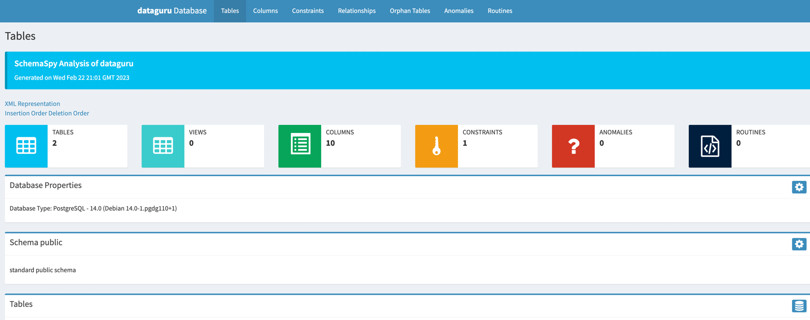
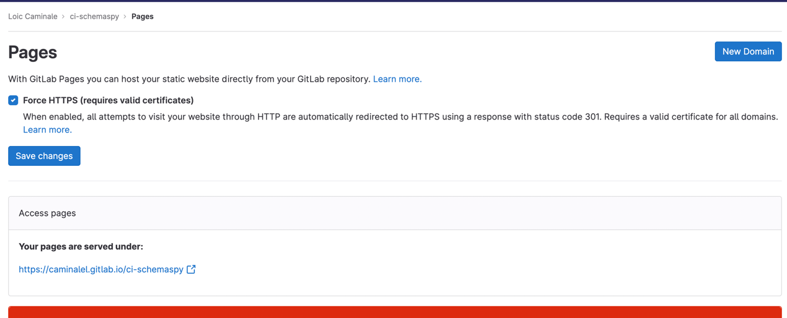

## Objectifs :

+ Comprendre l'importance de documenter sa bdd
+ Les commentaires sur les objets en base
+ Analyseur de métadonnées pour documenter notre SGBD 
+ Comment industrialiser sa documentation




<!--truncate-->

------------

## Pourquoi

La **documentation** d'une base de données est importante pour plusieurs raisons :

1. `Comprendre la structure` : Elle aide les développeurs et les administrateurs à comprendre la structure de la base,
                               les tables, les colonnes et les relations entre elles.

2. `Collaboration` : Elle facilite la collaboration entre les développeurs et les administrateurs en fournissant une 
                     description claire et concise de la structure de la base.

3. `Maintenance` : Elle aide à identifier et à corriger les erreurs dans la structure de la base, ce qui peut réduire 
                   le temps de maintenance et les coûts associés.

4. `Transparence` : Elle aide à garantir la transparence de la structure de la base et à fournir une vue d'ensemble de 
                    son fonctionnement pour les audits et les examens de sécurité.

5. `Mise à jour et évolution` : La documentation peut aider à planifier les mises à jour et les évolutions de la base 
                                en fournissant une vue d'ensemble de sa structure actuelle.

------------

## Les commentaire sur les objets de base de données


Les commentaires sur les objets de base de données sont des descriptions ou des annotations que l'on peut ajouter à des 
éléments tels que des tables, des colonnes, des vues, des procédures stockées, etc. dans une base de données.   
Les commentaires peuvent fournir des informations supplémentaires sur l'objet, telles que son but, ses limites, 
ses exigences, etc. Ils peuvent également aider à la compréhension du code, à la documentation et à la collaboration 
entre les développeurs.

La manière de créer et de gérer des commentaires sur les objets de base de données dépend du système de gestion de base 
de données (SGBD) utilisé. Par exemple, pour ajouter un commentaire à une table dans MySQL, vous pouvez utiliser la 
commande ALTER TABLE suivante:

```sql
ALTER TABLE table_name COMMENT 'description de la table';
```

Dans Oracle et Postgres, vous pouvez utiliser la commande COMMENT suivie du nom de l'objet et du commentaire souhaité:

```sql
COMMENT ON TABLE table_name IS 'description de la table';
```

Les commentaires sur les objets de base de données peuvent être consultés à l'aide de commandes spécifiques pour chaque
SGBD ou à l'aide d'outils de gestion de base de données tels que : `phpMyAdmin`, `Oracle SQL Developer`, 
`Microsoft SQL Server Management Studio`, etc.


## Outils de documentation de SGBD

Utiliser un analyseur de métadonnées de base de données pour documenter notre SGBD peut être très bénéfique pour plusieurs raisons, notamment :

1. `Documentation exhaustive` : L'analyseur de métadonnées peut extraire des informations sur la structure, les relations, 
les types de données, les index et les contraintes de la base de données. 
Ces informations peuvent être utilisées pour générer une documentation qui fournit une image complète du schéma de la base de données.

2. `Gain de temps` : La documentation manuelle d'une base de données peut être une tâche **chronophage**, en particulier 
pour les bases de données **volumineuses** et **complexes**. L'utilisation d'un analyseur de métadonnées peut 
permettre de gagner du temps et des efforts en **générant automatiquement** la documentation.

3. `Précision` : L'analyseur de métadonnées peut extraire des informations précises et à jour sur la base de données, 
garantissant que la documentation est précise et fiable.

4. `Standardisation` : L'utilisation d'un analyseur de métadonnées garantit que la documentation est normalisée et 
cohérente sur l'ensemble de la base de données, ce qui la rend plus facile à comprendre et à maintenir.

5. `Communication` : La documentation générée par un analyseur de métadonnées peut être utilisée pour communiquer la 
structure et le contenu de la base de données aux parties prenantes, notamment les développeurs, les testeurs, les analystes métier et les autres membres de l'équipe.

Dans l'ensemble, l'utilisation d'un analyseur de métadonnées de notre SGBD peut nous aider à mieux comprendre, gérer et 
communiquer les informations sur nos bases de données, ce qui peut conduire à une amélioration de l'efficacité, 
de la précision et de la productivité.


## Comment industrialiser sa documentation

Dans cette section, nous allons explorer comment industrialiser la génération de documentation sur vos SGBD en utilisant `SchemaSpy` comme analyseur de métadonnées et `GitlabCI` comme outil de CI.

Une fois que vous avez installé `SchemaSpy` en local, vous pouvez générer de la documentation sur vos SGBDs.
La documentation générée sera sous forme de fichiers statiques `HTML`, `CSS` et `JS`.

Cependant, dans cette section, nous nous concentrerons sur la façon d'industrialiser cette documentation dans une CI. 

**Avant de commencer, il est important de se poser les questions suivantes :**

+ Sur quel environnement voulez-vous générer votre documentation : `Dev`, `Staging`, `Prod` ?
+ Comment SchemaSpy accède-t-il aux métadonnées de votre base de données cible ? `En direct` ?
+ Sur quel service d'hébergement souhaitez-vous déployer votre documentation ? `Gitlab/Github Pages`, `Netlify`, `AWS S3` ?
+ Voulez-vous versionner cette documentation ? Via `Git`, sauvegarde d'`artefacts` dans une CI...?

**Dans cet exemple, nous allons industrialiser la génération de documentation avec le contexte suivant :**

+ Pas d'environnement spécifique
+ Simulation de restauration grâce à un script chargé au démarrage d'un service postgres dans notre CI
+ Connexion de SchemaSpy au service Postgres et génération de la documentation
+ Exposition de la doc' sur Gitlab Pages.
+ Sauvegarde des documentations sur les artifacts de gitlab, les anciennes versions sont disponibles sur ce service

Passons au code, tout d'abord il va nous falloir le script sql qui va nous permettre de simuler la restauration d'une 
base de données : (fichier qu'on nommera `initdb/init-db.sql`)

```sql
CREATE TYPE sexe AS ENUM ('AUTRE', 'FEMME', 'HOMME');
CREATE TABLE ville
(
    id        VARCHAR UNIQUE PRIMARY KEY,
    nom       VARCHAR NOT NULL,
    longitude NUMERIC NOT NULL,
    latitude  NUMERIC NOT NULL,
    UNIQUE (nom, latitude)
);

CREATE TABLE utilisateur
(
    id       VARCHAR UNIQUE PRIMARY KEY,
    prenom   VARCHAR                 NOT NULL,
    nom      VARCHAR                 NOT NULL,
    age      VARCHAR                 NOT NULL,
    ville_id VARCHAR                 NOT NULL REFERENCES ville (id),
    sexe     sexe NOT NULL
);

COMMENT ON COLUMN utilisateur.prenom is 'Est le prenom de l utilisateur';
COMMENT ON COLUMN utilisateur.nom is 'Est le nom de naissance de l utilisateur';
COMMENT ON COLUMN utilisateur.age is 'Est l age de l utilisateur';
COMMENT ON COLUMN utilisateur.ville_id is 'Est la clé primaire qui fait référence à la ville où l utilisateur habite';
COMMENT ON COLUMN utilisateur.sexe is 'Est le sexe de l utilisateur de type sexe';

INSERT INTO ville (id, nom, longitude, latitude)
VALUES ('c4e5fcc2-ab73-11ed-afa1-0242ac120002', 'Paris', 2.333333, 48.86);

INSERT INTO utilisateur (id, prenom, nom, age, ville_id, sexe)
VALUES ('f43692ad-9f11-4ce2-8d21-078e79ea21a3', 'Loïc', 'cam', 28, 'c4e5fcc2-ab73-11ed-afa1-0242ac120002', 'HOMME');
```

Une fois le fichier sql écrit et mis dans un dossier au niveau de la racine à l'emplacement : `initdb/init-db.sql`
Nous pouvons passer à l'écriture de notre pipeline : 

```yaml
stages:
    - Documentation

pages:
    image: openjdk:8-jdk-alpine
    services:
        - name: postgres:14.0
          alias: postgres
    variables:
        POSTGRES_DB: dataguru
        POSTGRES_USER: postgres
        POSTGRES_PASSWORD: $CI_POSTGRES_PASSWORD
    stage: Documentation
    script:
        - apk add postgresql-client
        - apk update && apk add graphviz ttf-dejavu wget
        - wget https://github.com/schemaspy/schemaspy/releases/download/v6.1.0/schemaspy-6.1.0.jar -P /schemaspy
        - export PGPASSWORD=$POSTGRES_PASSWORD
        - psql -h "postgres" -U "$POSTGRES_USER" -d "$POSTGRES_DB" -f ./initdb/init-db.sql
        - wget https://jdbc.postgresql.org/download/postgresql-42.3.0.jar -P /drivers_inc/
        - java -jar /schemaspy/schemaspy-6.1.0.jar -t pgsql -db "$POSTGRES_DB" -host "postgres" -port 5432 -s public -u "$POSTGRES_USER" -p "$POSTGRES_PASSWORD" -o ./public -dp /drivers_inc/postgresql-42.3.0.jar
    artifacts:
        expire_in: '2 weeks'
        paths:
          - public/
```

> :warning: La pipeline actuelle n'est pas optimisée et ne suit pas les bonnes pratiques.
> Une solution possible serait de créer une image Docker qui contiendrait toutes les dépendances nécessaires pour générer la documentation. Cette approche permettrait de simplifier et d'améliorer la rapidité de la pipeline. 

Workflow d'exécution de la pipeline : 


Et votre documentation sera accessible : `https://username.gitlab.io/repo_name/`




