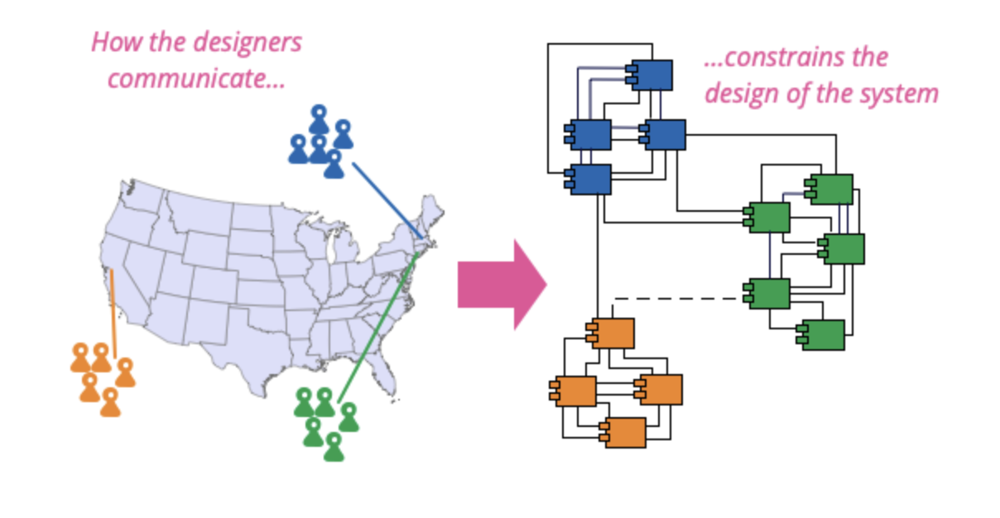

En 1968, Melvin Conway a publié un article intitulé **"How Do Committees Invent ?"**  [[1]](https://www.melconway.com/Home/Committees_Paper.html)  dans lequel il examine la relation entre la structure d'une organisation et la conception d'un système. Il est devenu célèbre pour avoir formulé ce qui est maintenant connu sous le nom de **loi de Conway** :

>  **Toute organisation qui conçoit un système, au sens large, concevra une structure qui sera la copie de la structure de communication de l’organisation.**

**Conway's Law** Martin Fowler [[2]](https://martinfowler.com/bliki/ConwaysLaw.html)

<!--truncate-->

Pendant la conception d'un système, son architecture a de fortes chances de ressembler à l’organisation de l'équipe qui l'a conçue.
Si l'on considère trois équipes travaillant sur le développement d'une même solution, il est fort probable que la base de code soit divisée en trois sous-parties distinctes.

Alan MacCormack, John Rusnak, et Carliss Baldwin essaient de prouver cette corrélation dans leur recherche intitulée
** Exploring the Structure of Complex Software Designs: An Empirical Study of Open Source and Proprietary Code** [[3]](https://www.researchgate.net/publication/220534289_Exploring_the_Structure_of_Complex_Software_Designs_An_Empirical_Study_of_Open_Source_and_Proprietary_Code).

En utilisant le **DSM (Design Structure Matrix)** [[4]](https://www.idp-innovation.com/design-structure-matrix-dsm-modeliser-la-complexite-en-developpement-de-produits/)
, un outil qui vise à modéliser la complexité d'un système en examinant ses dépendances.

**Exemple d’un matrice DSM**

Ils analysent la base de code de `Linux` et `Mozilla` et obtienne les résultats suivants :

+ Le projet Linux, qui est un projet **open source** conçu pour la collaboration **décentralisée** entre des personnes du monde entier, a une **architecture modulaire**.

+ Le navigateur Netscape, avant son passage en open source sous le nom de Mozilla et qui était géré de **manière propriétaire** par une équipe interne, avait une **architecture fortement couplée**.

+ Après son passage en open source, Mozilla a subi une refactorisation globale pour devenir plus modulaire et moins couplé que Linux !

Leur étude met en lumière l'influence de l'organisation des équipes sur la modularité du code. La collaboration distribuée inhérente à l'open source encourage la conception d'une architecture de code plus modulaire, avec une faible interdépendance entre les différents éléments.

Il est crucial de considérer la structure de l'équipe lors de la conception d'une architecture. Ignorer la structure organisationnelle peut mener à des divergences significatives par rapport au design initial.

## Conway inversé

Dans son talk "Microservices and the Inverse Conway Manoeuvre", James Lewis présente une approche appelée  "Conway inversé"  qui consiste à organiser l'équipe de manière à atteindre l'architecture désirée.

    <iframe width="100%" height="400" src="https://www.youtube.com/embed/CsZDGlz7O5w" title="YouTube video player" frameborder="0" allow="accelerometer; autoplay; clipboard-write; encrypted-media; gyroscope; picture-in-picture; web-share" allowfullscreen></iframe>

------------

Une technique largement employée par les **entreprises performantes** actuelles, qui augmente les chances de développer des **solutions efficaces** et maintenables de manière naturelle.

Pour créer une architecture modulaire composée de plusieurs domaines distincts, il est préférable de former une équipe pour chaque domaine spécifique. Cela permettra de progresser naturellement vers l'objectif final envisagé.

## Conclusion

De nombreuses organisations continuent de rencontrer des difficultés pour mettre en place des architectures innovantes, souvent pour de mauvaises raisons.

En effet, travailler sur le cloud tout en conservant une organisation cloisonnée ne va pas forcément vous aider à réduire votre lead time.

La loi de Conway nous rappelle une vérité simple: si la structure de l'organisation ne correspond pas à l'architecture souhaitée, l'adoption des dernières tendances technologiques ne suffira pour atteindre les résultats escomptés.

Et comme le dit si bien  **Ryth Malan** :

> Si l'architecture du système et l'architecture de l'organisation sont en désaccord, l'architecture de l'organisation l'emporte.
