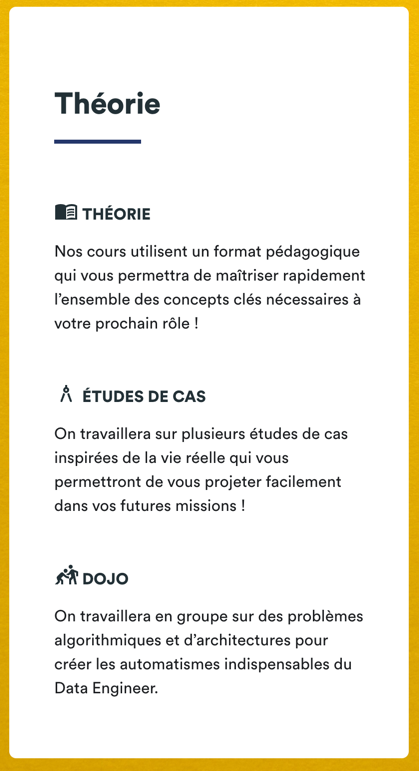

I - Example 





II - Code 

```
<MutltilineMessageWithTitle
          title={"Pratique"}
          items={[
              {
                  icon: <ScienceIcon viewBox="0 -4 24 24"/>,
                  title: "Travaux pratiques ",
                  text: "Des TPs sont donnés lors des cours afin de dynamiser et d'appliquer les concepts\n" +
                   "théoriques."
              },
              {
                  icon: <DashboardIcon viewBox="0 -4 24 24"/>,
                  title: "Ateliers Architectures",
                  text: "Les ateliers d'architectures sont animés durant les séances live, il faudra\n" +
                   "proposer une architecture cible par rapport à un besoin."
              },
              {
                  icon: <EngineeringIcon viewBox="0 -4 24 24"/>,
                  title: "Projet fil rouge",
                  text: "Un travail de cadrage suivi d'un Proof of concept (PoC) vous sera demandé\n" +
                  "sur plusieurs semaines pour finaliser cette formation."
              }
          ]}
/>
```