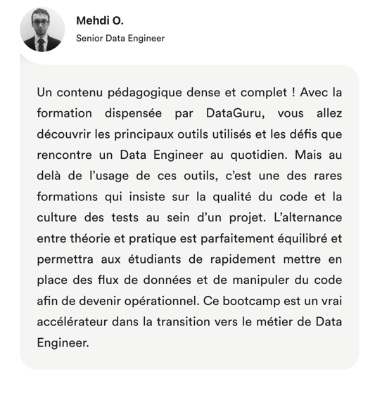

I - Example 





II - Code 

```
 <Avis name={"Mehdi O."}
      photo={MehImage}
      subtitle={"Senior Data Engineer"}
      text={"\n" +
      "Un contenu pédagogique dense et complet ! Avec la formation dispensée par DataGuru, " +
      "vous allez découvrir les principaux outils utilisés et les défis que rencontre un Data Engineer au " +
      "quotidien. Mais au delà de l’usage de ces outils, c’est une des rares formations qui insiste sur la " +
      "qualité du code et la culture des tests au sein d’un projet. L’alternance entre théorie et pratique est " +
      "parfaitement équilibré et permettra aux étudiants de rapidement mettre en place des flux de données et de" +
      " manipuler du code afin de devenir opérationnel. Ce bootcamp est un vrai accélérateur dans la transition vers " +
      "le métier de Data Engineer."}
 />
```