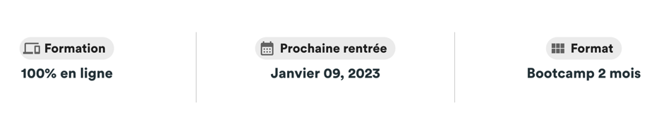

I - Example 





II - Code 

```
   <ThreeItemsInLine
        firstItem={<MessageWithIcon icon={<DevicesIcon/>} label={"Formation"} headline={"100% en ligne"}/>}
           
        secondItem={<MessageWithIcon icon={<CalendarMonthIcon/>} label={"Prochaine rentrée"} headline={"Janvier 09, 2023"}/>}
     
        thirdItem={<MessageWithIcon icon={<ViewModuleIcon/>} label={"Format"} headline={"Bootcamp 2 mois"}/>}
    />
```